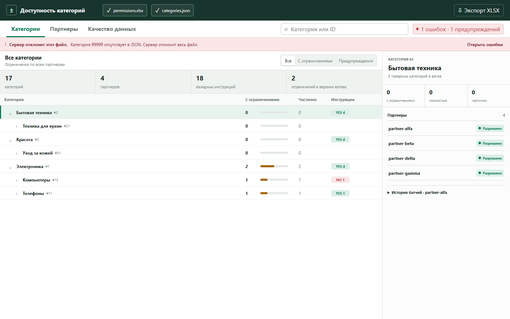

# Category Whitelist Viewer

Локальное read-only приложение для анализа партнерских whitelist по иерархическому дереву категорий.



## Возможности

- загрузка Excel и JSON напрямую в браузере без отправки данных на сервер;
- последовательное выполнение `yes`/`no`-батчей для каждого партнера;
- просмотр ограничений по категориям и по выбранному партнеру;
- поиск, фильтрация проблемных веток и диагностика исходных данных;
- обнаружение неизвестных категорий и избыточных инструкций;
- экспорт сводок, ошибок и предупреждений в новый XLSX-файл;
- автономная сборка в одном HTML-файле.

## Запуск

Откройте [`dist/category-permissions.html`](dist/category-permissions.html) в современном браузере и выберите Excel с разрешениями и JSON с деревом категорий.

Тестовые файлы:

- [`app/samples/permissions.xlsx`](app/samples/permissions.xlsx)
- [`app/samples/categories.json`](app/samples/categories.json)

Подробное описание форматов находится в [`app/README.md`](app/README.md).

## Разработка

```powershell
npm install
npm run build
npx playwright install chromium
npm run test:e2e
```

Сборка создает `dist/category-permissions.html` со встроенными CSS, JavaScript и SheetJS Community Edition.

## Конфиденциальность

Выбранные файлы обрабатываются только в памяти браузера. Приложение не выполняет сетевых запросов и не сохраняет загруженные данные после закрытия страницы.

